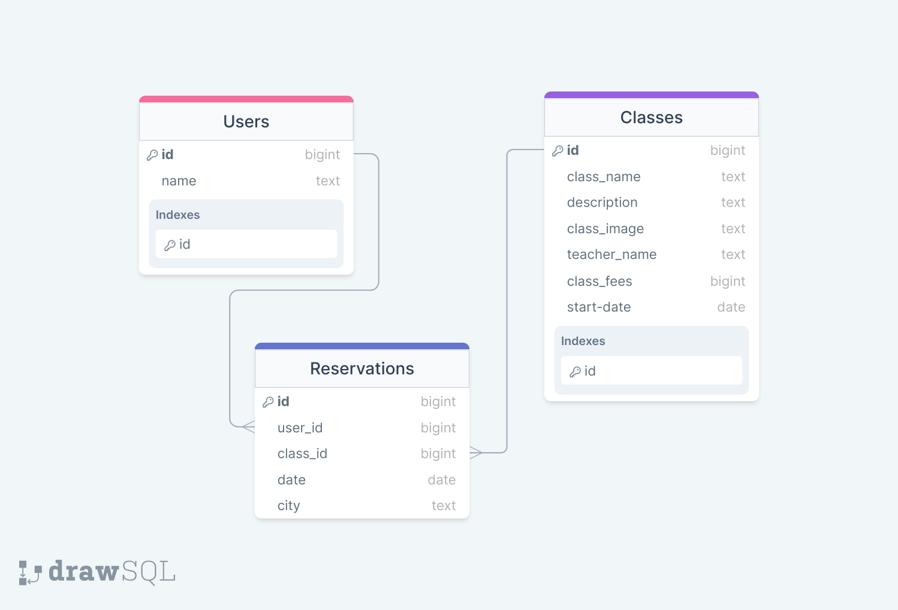

> # EduPlanner Backend

| EduPlanner Schema ERD |
|---------------------------------------|
|<div align="center" width="auto"></div>|
# 📗 Table of Contents

- [📖 About the Project](#about-project)
  - [Link To The Frontend](#FrontEnd-link)
  - [KanBan Board](#kanban-board)
  - [🛠 Built With](#built-with)
    - [Key Features](#key-features)
  - [🚀 Live Demo](#live-demo)
- [💻 Getting Started](#getting-started)
  - [Prerequisites](#prerequisites)
  - [Setup](#setup)
- [👥 Authors](#authors)
- [🔭 Future Features](#future-features)
- [🤝 Contributing](#contributing)
- [⭐️ Show your support](#support)
- [🙏 Acknowledgements](#acknowledgements)
- [FAQ](#faq)
- [📝 License](#license)

<!-- PROJECT DESCRIPTION -->

# 📖 EduPlanner-Backend <a name="about-project"></a>

**EduPlanner-Backend:** This is the Backend Api for the EduPlanner web application project. A rails based backend solution to storing class and student data from the EduPlanner web application.

# Front End React app link <a name="FrontEnd-link"></a>

[React Frontend](https://github.com/ab-noori/EduPlanner-Frontend)

## 🛠 Built With <a name="built-with"></a>

  <ul>
    <li>Ruby</li>
    <li>Rails</li>
    <li>PostgreSQL</li>
  </ul>

<!-- Features -->

### Key Features <a name="key-features"></a>

- **Store data for the EduPlanner website**
- **Provide Api endpoints for data Entry**
- **Provide server side validations**

<p align="right">(<a href="#readme-top">back to top</a>)</p>

## 🚀 Live Demo <a name="live-demo"></a>
[liveDemo](https://edu-planner.onrender.com/)

<p align="right">(<a href="#readme-top">back to top</a>)</p>

## KanBan Board
[KanBan Project link](https://github.com/users/ab-noori/projects/12)

[Initial Kanban Board state](https://user-images.githubusercontent.com/125574259/271379687-ac62e9d1-7816-497c-b31c-988240bd3eec.png)

**Our team was comprised of 3 developers @Aimable BANCUNGUYE, @Abdul Ali Noori, @gisa chris**

<p align="right">(<a href="#readme-top">back to top</a>)</p>

## Getting Started

To get a local copy up and running, follow these steps.

### Prerequisites
In order to run this project you need:
  * A basic understanding of Ruby, Rails and Git
  * A postgresql connection
  * Create some data before running to see Greatings
### Usage
1. Install Ruby
2. Install Rails
3. Clone this repo
```
git clone https://github.com/ab-noori/EduPlanner-Backend.git
```

To run the project, execute the following command:

```
  rails server
```

To add some greetings to your application run the following commands

``````
rails db:drop
rails db:create
rails db:migrate
rails db:seed
``````

<p align="right">(<a href="#readme-top">back to top</a>)</p>

<!-- AUTHORS -->

## 👥 Author <a name="authors"></a>

👤 : **Gisa Chris**

- GitHub: [@gisa chris](https://github.com/gisachris)
- LinkedIn: [@gisa chris](https://linkedin.com/in/gisa-chris/)

👤 : **Abdulali noori**

- GitHub: [@Abdul Ali Noori](https://github.com/ab-noori)
- LinkedIn: [@Abdul Ali Noori](https://linkedin.com/in/abdulali-noori)

👤 : **Aimable BANCUNGUYE**

- GitHub: [@Aimable BANCUNGUYE](https://github.com/BANCUNGUYE66)
- LinkedIn: [@Aimable BANCUNGUYE](https://www.linkedin.com/in/aimable-bancunguye-aba703143/)


<p align="right">(<a href="#readme-top">back to top</a>)</p>


<!-- FUTURE FEATURES -->

## 🔭 Future Features <a name="future-features"></a>

- **Google authentication**
- **More Class based features**
- **More Student based features**

<p align="right">(<a href="#readme-top">back to top</a>)</p>

<!-- CONTRIBUTING -->

## 🤝 Contributing <a name="contributing"></a>

Contributions, issues, and feature requests are welcome!

Feel free to check the [issues page](https://github.com/ab-noori/EduPlanner-Backend/issues).

<p align="right">(<a href="#readme-top">back to top</a>)</p>

<!-- SUPPORT -->

## ⭐️ Show your support <a name="support"></a>

Please support this project, your contribution can make a significant difference.

<p align="right">(<a href="#readme-top">back to top</a>)</p>

<!-- ACKNOWLEDGEMENTS -->

## 🙏 Acknowledgments <a name="acknowledgements"></a>

Original design idea by [ Murat Korkmaz on Behance.](https://www.behance.net/gallery/26425031/Vespa-Responsive-Redesign)

<p align="right">(<a href="#readme-top">back to top</a>)</p>

## FAQ <a name="faq"></a>

- **Can I use this repository?**

Please feel free to fork this repository for your own projects.

- **Will my changes be accepted?**

We welcome any improvements if your changes are good and align with the project's goals.


<p align="right">(<a href="#readme-top">back to top</a>)</p>

<!-- LICENSE -->

## 📝 License <a name="license"></a>

This project is [MIT](./LICENSE) licensed.

<p align="right">(<a href="#readme-top">back to top</a>)</p>
